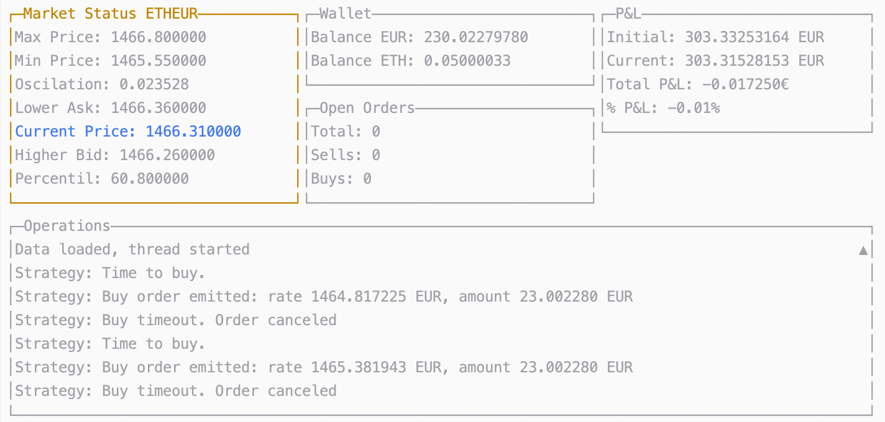

# AOCryptobot

## Current development

Signal trading is here!! You can now develop your own strategies with some well known market analysis most famous indicators. 

## Changelog

[07 APR 2020]
- Add signal-trading system with strategy analysis algorithms
- Add exit rules to oscillator system
- Add well-known market analysis algorithms as strategy pre and post conditions
- Refactor folders to get prepare for new trading systems
- Add fallback system to get back the unexpected residues from sell side
- Remove MarketSnapshotRecords list as an argument on MarketService functions
- Log totals on wallet update
- Add Ctrl+C detection to exit bot
- Refactor common package into 'service' root folder
- Refactor Go config to Module usage
- Fix e5 error 'The relationship of the prices for the orders its not correct'
- Log to file and simplify UI list appending
- Add .gitignore
- Add multi-threading support
- Prevent setting Market Status on empty ws response
- Prevent nil pointer reference errors on unsuccesful OrderCancel/GetOrder request
- Ensure any bid an ask is always present when market_snapshot is recorded
- Remove hardcoded pair occurrences

[09 FEB 2020]
- **Add user interface**: A graphic interface has been integrated. Still some bugs to make it stable, but milestone is not so far away.
- Fix order cancel and get sellingTimeout correctly working
- Resolve "Refactor binance monitor replacing REST with websocket calls"
- Update conf.env
- Add CODEOWNERS file

# Signal Trader Mode

From the 07 APR 2020 merges, Market Maker mode are now combined with a Signal Trader mode.

#### Technical indicators

With the help of sdcoffey/techan, we can use different technical indicators such as RSI, MACD, BoilerBands, StochasticRSI, EMA...

#### Strategies

Tech indicators can be combined now to create strategies, with enter and exit rules over candles samples. In the same strategy logic, we can set an analysis algorithm to calculate backtest results from past samples, and a set of rules to declare it tradeable or not, depending on the analysis results. This means you can create an aggresive strategy and set the activation rules on for example "strategy had at least a 5% of profit on the backtest analysis, a custom ration between average profit per operation and std deviation", etcetc

The Signal Trader supports multiple streategies combinations, and provides another algorithm that is always running in the background, analysing each strategy in a backtest, and defining if it is tradeable or not. In the same way, exist a configurable function where to develop strategy choosing.

For example, after analyse ETHEUR:

Strategy 1 (lets say RSI based):
- Backtest profit in last 5 days 2,31%, std dev 4,54%. Strategy says is tradeable

Strategy 2 (lets say EMA based):
- Backtest profit in last 5 days -1,31%, std dev 12,54%. Strategy says is not tradeable

Strategy 3 (lets say MACD based):
- Backtest profit in last 5 days 4,31%, std dev 1,54%. Strategy says is tradeable

Choice rules are take the best profit / std dev ratio, so MACD is selected. Start trading.

##### Parametrizing strategies

Alanlyzer algorithms can, in addition to calculate profits with backtest, try the backtests with different parameters. Lets say you develop an strategy with the enter rule "enter if EMA increases in X (being X a parameter)" and the exit rule the same bit inverse. **The backtesting algorithm can calculate the best parameters combination** in terms of profit. So the bot calculates not only your past profit but the best combination of parameters to get the maximum profit. This is because if the market is, for example, more stable, the slope necessary to get the bigger profit could be different than in other situations, so the slope (of the way you use the parameters) change in different market situations, **the bot will calculate it and proceed to trade always with the best combination**. Pretty amazing :)

# Market Maker Mode

#### Market monitor
The bot monitors the market during `monitorWindow` seconds with a `monitorFrequency` also in seconds.

#### Buy
The signal it uses to do a buy is calculated through the percentil in which the current center price is, and
a strategy-given variables `topPercentileToTrade` and `lowPercentileToTrade`. This means that if the current center
price is on a percentil between that values, the buy is triggered.

Example:
Monitor window higher price: 1100
Monitor window lower price: 900
topPercentileToTrade: 100 
lowPercentileToTrade: 50

The buy will be triggered when the current center price be from 1000 and 1000.
The amount and the value of the buy will be defined in the strategy (`strategy.env`)
as `pctAmountToTrade` (over your wallet total) and `buyMargin` (pct below the center price)

#### Sell
At the moment that a buy is successful, a OCO sell order is triggered.

An OCO order is a One-Cancel-Other order, so it implies the creation or 2 mutually exclusive order:
 - Sell order for the value of the buy including the `sellMargin` (pct over the buy cost)
 - Stop loss-limit order for the value of the `stopLossPct` percentage
 
That implies that the sell order will be complete or taking the benefit or by the stop-loss percentage

##### This buy-sell process will be infinite repeated
 

### Usage

1. Install dependencies with
`go mod download`

2. Test with
`go test ./..`

2. Run with
`go run main.go`

### Strategy file

The strategy file is `marketmaker/strategy.env`

### Open Source

The development is open to everyone and everything, to new market strategies such as arbitrage,
perpetual market making... Just use as you need.

I would like to integrate market signals as MACD, RSI, BoilerBands, etcetc... and create a real strategy, being able 
to choose between or combine them.

A very interesting lib to do it is github.com/sdcoffey/techan
